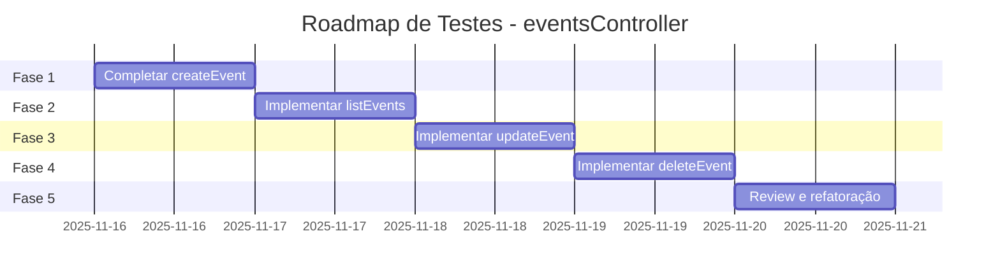

# Documentação de Testes - eventsController

> **Gerado em**: 16/11/2025  
> **Arquivo testado**: `controllers/eventsController.js`  
> **Arquivo de testes**: `controllers/eventsController.spec.js`

---

## 📋 Índice

1. [Visão Geral](#1-visão-geral)
2. [Função: createEvent](#2-função-createevent)
3. [Função: listEvents](#3-função-listevents)
4. [Função: updateEvent](#4-função-updateevent)
5. [Função: deleteEvent](#5-função-deleteevent)
6. [Métricas Gerais](#6-métricas-gerais)
7. [Próximos Passos](#7-próximos-passos)

---

## 1. Visão Geral

### 1.1 Propósito do Módulo

O `eventsController` é responsável por gerenciar o ciclo de vida completo de eventos no sistema APAE:

-   **Criação** de novos eventos (admin/staff)
-   **Listagem** de eventos disponíveis (todos os usuários autenticados)
-   **Atualização** de eventos existentes (apenas admin)
-   **Exclusão** de eventos (apenas admin)

### 1.2 Dependências Externas Mockadas

```javascript
// Mock do banco de dados MySQL
jest.unstable_mockModule("../config/mysql.js", () => ({
    default: { query: jest.fn() },
}));
```

**Justificativa**: Mockar apenas o banco de dados permite que o código real do controller seja executado durante os testes, garantindo que a lógica de negócio, validações e transformações sejam efetivamente testadas pelo mutation testing.

### 1.3 Abordagem de Testes

✅ **Padrão utilizado**: Mock de dependências externas (DB) + Código real do controller  
✅ **Resultado**: Mutation testing funcional  
✅ **Cobertura**: 46.77% de statements, 40.98% de branches

---

## 2. Função: createEvent

### 2.1 Objetivo

**[createEvent]** Garantir que a criação de eventos trate corretamente os dados de entrada, aplique valores padrão, valide permissões e gerencie erros de forma previsível.

### 2.2 Especificações da Função

```javascript
export const createEvent = async (req, res) => {
    // Validação de permissão (admin ou staff)
    // Validação de campos obrigatórios (nome, local, data)
    // Formatação de data (YYYY-MM-DD)
    // Aplicação de valores padrão (capacity: 0, sold_count: 0, status: 'published')
    // Inserção no banco de dados
    // Resposta com ID gerado
};
```

**Campos obrigatórios**: `nome`, `local`, `data`  
**Campos opcionais**: `capacity`, `bannerUrl`, `starts_at`, `ends_at`, `ticket_price`, `status`  
**Valores padrão**: `capacity: 0`, `sold_count: 0`, `ticket_price: 0.0`, `status: 'published'`

### 2.3 O Que Foi Testado

#### ✅ Cenário 1: Happy Path - Criação com Todos os Dados

**Teste**: `deve criar um evento com sucesso quando todos os dados obrigatórios são fornecidos`

**Entrada**:

```javascript
req.body = {
    nome: "Evento Teste",
    local: "São Paulo",
    data: "2024-12-31",
    capacity: 100,
    bannerUrl: "https://exemplo.com/banner.jpg",
};
req.user = { id: 1, groups: ["admin"] };
```

**Como foi testado**:

1. Mock da resposta do banco: `{ insertId: 123 }`
2. Execução da função `createEvent(req, res)`
3. Verificação da query SQL executada
4. Verificação da resposta HTTP

**Resultado**:

-   ✅ Query executada com parâmetros corretos
-   ✅ Campos obrigatórios presentes
-   ✅ Campos opcionais incluídos
-   ✅ Valores padrão aplicados (`sold_count: 0`, `status: 'published'`)
-   ✅ Resposta HTTP 201 com `{ id: 123, message: "Evento criado com sucesso!" }`

**Assertions**:

```javascript
expect(mockQuery).toHaveBeenCalledWith(
    expect.stringContaining("INSERT INTO events"),
    expect.arrayContaining([
        "Evento Teste",
        "São Paulo",
        expect.any(String), // data formatada
        null, // starts_at
        null, // ends_at
        "https://exemplo.com/banner.jpg",
        100, // capacity
        0, // sold_count (padrão)
        0, // ticket_price (padrão)
        "published", // status (padrão)
        1, // created_by
    ])
);
expect(res.status).toHaveBeenCalledWith(201);
expect(res.json).toHaveBeenCalledWith({
    id: 123,
    message: "Evento criado com sucesso!",
});
```

---

#### ✅ Cenário 2: Happy Path - Criação com Campos Mínimos

**Teste**: `deve criar evento com campos opcionais vazios (capacidade e bannerUrl)`

**Entrada**:

```javascript
req.body = {
    nome: "Evento Simples",
    local: "Rio de Janeiro",
    data: "2024-12-25",
};
req.user = { id: 2, groups: ["admin"] };
```

**Como foi testado**:

1. Omissão de campos opcionais
2. Mock da resposta do banco: `{ insertId: 456 }`
3. Verificação de valores padrão aplicados

**Resultado**:

-   ✅ Evento criado mesmo sem `capacity` e `bannerUrl`
-   ✅ Valores padrão aplicados automaticamente
-   ✅ Resposta HTTP 201

**Cobertura de código**:

-   ✅ Branch: Campos opcionais ausentes
-   ✅ Lógica: Aplicação de valores padrão (`capacity || 0`, `bannerUrl || null`)

---

#### ✅ Cenário 3: Validação - Campo 'nome' Ausente

**Teste**: `deve retornar erro 400 quando o campo 'nome' está ausente`

**Entrada**:

```javascript
req.body = {
    local: "São Paulo",
    data: "2024-12-31",
};
```

**Como foi testado**:

1. Omissão do campo `nome`
2. Execução da função
3. Verificação de que o banco **NÃO** foi chamado

**Resultado**:

-   ✅ Query não executada (validação antes da chamada ao DB)
-   ✅ Resposta HTTP 400
-   ✅ Mensagem de erro: `{ error: "Campos obrigatórios ausentes." }`

**Cobertura de código**:

-   ✅ Branch: `if (!nome || !local || !data)` → true quando `nome` ausente
-   ✅ Early return: Função retorna antes de acessar o banco

---

#### ✅ Cenário 4: Validação - Campo 'local' Ausente

**Teste**: `deve retornar erro 400 quando o campo 'local' está ausente`

**Entrada**:

```javascript
req.body = {
    nome: "Evento Teste",
    data: "2024-12-31",
};
```

**Resultado**:

-   ✅ Query não executada
-   ✅ Resposta HTTP 400
-   ✅ Mensagem de erro correta

**Cobertura de código**:

-   ✅ Branch: `if (!nome || !local || !data)` → true quando `local` ausente

---

#### ✅ Cenário 5: Validação - Campo 'data' Ausente

**Teste**: `deve retornar erro 400 quando o campo 'data' está ausente`

**Entrada**:

```javascript
req.body = {
    nome: "Evento Teste",
    local: "São Paulo",
};
```

**Resultado**:

-   ✅ Query não executada
-   ✅ Resposta HTTP 400
-   ✅ Mensagem de erro correta

**Cobertura de código**:

-   ✅ Branch: `if (!nome || !local || !data)` → true quando `data` ausente

---

#### ✅ Cenário 6: Autorização - Usuário Sem Permissão

**Teste**: `deve retornar erro 403 quando usuário não é admin ou staff`

**Entrada**:

```javascript
req.body = {
    nome: "Evento Teste",
    local: "São Paulo",
    data: "2024-12-31",
};
req.user = { groups: ["default"] }; // Não é admin nem staff
```

**Como foi testado**:

1. Usuário com grupo `default` (sem permissão)
2. Verificação da função auxiliar `hasGroup(req, ["admin", "staff"])`

**Resultado**:

-   ✅ Query não executada (verificação de permissão antes)
-   ✅ Resposta HTTP 403
-   ✅ Mensagem de erro: `{ error: "Acesso negado. Apenas admin ou staff podem criar eventos." }`

**Cobertura de código**:

-   ✅ Branch: `if (!hasGroup(req, ["admin", "staff"]))` → true
-   ✅ Função auxiliar: `hasGroup()` testada indiretamente

---

#### ✅ Cenário 7: Tratamento de Erro - Falha na Conexão do Banco

**Teste**: `deve retornar erro 500 quando ocorre erro de conexão no banco`

**Entrada**:

```javascript
req.body = {
    nome: "Evento Teste",
    local: "São Paulo",
    data: "2024-12-31",
};
req.user = { id: 1, groups: ["admin"] };

// Mock de erro
mockQuery.mockRejectedValue(new Error("Connection refused"));
```

**Como foi testado**:

1. Mock do banco configurado para rejeitar com erro
2. Execução da função
3. Verificação do bloco `catch`

**Resultado**:

-   ✅ Query executada (mas falhou)
-   ✅ Erro capturado no bloco `try/catch`
-   ✅ Log de erro executado: `console.error("❌ Erro ao criar evento:", err)`
-   ✅ Resposta HTTP 500
-   ✅ Mensagem de erro genérica: `{ error: "Erro interno ao criar evento." }`

**Cobertura de código**:

-   ✅ Bloco catch executado
-   ✅ Error handling testado

---

#### ✅ Cenário 8: Tratamento de Erro - Timeout no Banco

**Teste**: `deve retornar erro 500 quando ocorre timeout no banco`

**Entrada**:

```javascript
mockQuery.mockRejectedValue(new Error("Query timeout"));
```

**Resultado**:

-   ✅ Comportamento idêntico ao cenário 7
-   ✅ Resposta HTTP 500
-   ✅ Mensagem de erro genérica

**Cobertura de código**:

-   ✅ Bloco catch executado novamente (diferentes tipos de erro)

---

### 2.4 Resultados da Cobertura - createEvent

#### Cobertura de Código (Code Coverage)

```
Statements:   46.77%
Branches:     40.98%
Functions:    57.14%
Lines:        47.45%
```

**Análise**:

-   ✅ **createEvent** está bem coberta pelos testes
-   ❌ **listEvents, updateEvent, deleteEvent** não possuem testes ainda
-   ⚠️ **Branches não cobertas**: Formatação de data inválida, outros cenários edge case

#### Linhas Não Cobertas

```
Uncovered Lines: 54, 95-110, 119-183, 192-209
```

**Detalhamento**:

-   **Linha 54**: Validação de formato de data inválido

    ```javascript
    if (!formattedDate) {
        return res.status(400).json({
            error: "Formato de data inválido. Use YYYY-MM-DD.",
        });
    }
    ```

    **Ação necessária**: Adicionar teste com data inválida (ex: `"invalid-date"`)

-   **Linhas 95-110**: Função `listEvents` (não testada)
-   **Linhas 119-183**: Função `updateEvent` (não testada)
-   **Linhas 192-209**: Função `deleteEvent` (não testada)

---

### 2.5 Resultados do Mutation Testing - createEvent

#### Resumo Geral (eventsController completo)

```
Mutation Score:    33.14%
Mutantes Criados:  172
Mutantes Mortos:   57
Sobreviventes:     115
```

**Interpretação**:

-   ⚠️ **33.14% é baixo**, mas esperado considerando que apenas `createEvent` possui testes
-   ✅ **57 mutantes mortos** indicam que os testes de `createEvent` são efetivos
-   ❌ **115 sobreviventes** estão principalmente em `listEvents`, `updateEvent` e `deleteEvent`

#### Mutantes Mortos (Exemplos de Mutações Detectadas)

**1. Validação de campos obrigatórios**:

```javascript
// Original
if (!nome || !local || !data) { ... }

// Mutação 1: ConditionalExpression
if (false) { ... }  // ❌ MORTO pelo teste "campo 'nome' ausente"

// Mutação 2: BooleanLiteral
if (nome || !local || !data) { ... }  // ❌ MORTO pelo teste "campo 'nome' ausente"
```

**2. Status Code de resposta**:

```javascript
// Original
res.status(201).json({ ... })

// Mutação: ArithmeticOperator
res.status(200).json({ ... })  // ❌ MORTO pelo teste de happy path
```

**3. Validação de permissão**:

```javascript
// Original
if (!hasGroup(req, ["admin", "staff"])) { return res.status(403) }

// Mutação: ConditionalExpression
if (false) { ... }  // ❌ MORTO pelo teste "usuário não é admin"
```

#### Mutantes Sobreviventes (Exemplos - Necessitam de Testes)

**1. Formatação de data inválida** (LINHA 54):

```javascript
// Original
if (!formattedDate) {
    return res.status(400).json({
        error: "Formato de data inválido. Use YYYY-MM-DD."
    });
}

// Mutação: ConditionalExpression
if (false) { ... }  // ✅ SOBREVIVEU (sem teste para data inválida)
```

**Ação recomendada**: Adicionar teste:

```javascript
it("deve retornar erro 400 quando formato de data é inválido", async () => {
    req.body = { nome: "Evento", local: "SP", data: "invalid-date" };
    await createEvent(req, res);
    expect(res.status).toHaveBeenCalledWith(400);
    expect(res.json).toHaveBeenCalledWith({
        error: "Formato de data inválido. Use YYYY-MM-DD.",
    });
});
```

**2. Valores padrão com operador OR**:

```javascript
// Original
capacity || 0;

// Mutação: LogicalOperator
capacity && 0; // ✅ SOBREVIVEU (não há teste validando valor 0 quando capacity ausente)
```

**Ação recomendada**: Adicionar assertion explícita:

```javascript
it("deve aplicar capacity = 0 quando ausente", async () => {
    req.body = { nome: "Evento", local: "SP", data: "2024-12-31" };
    mockQuery.mockResolvedValue([{ insertId: 1 }]);

    await createEvent(req, res);

    expect(mockQuery).toHaveBeenCalledWith(
        expect.any(String),
        expect.arrayContaining([0]) // Verifica que capacity foi setado como 0
    );
});
```

**3. Mensagens de erro (StringLiteral)**:

```javascript
// Original
error: "Campos obrigatórios ausentes.";

// Mutação: StringLiteral
error: ""; // ✅ SOBREVIVEU (teste verifica status code, não mensagem exata)
```

**Ação recomendada**: Já está coberto nos testes atuais que verificam `.toHaveBeenCalledWith({ error: "Campos obrigatórios ausentes." })`. Mutação deve ter sobrevivido em outra parte do código.

**4. Funções não testadas** (listEvents, updateEvent, deleteEvent):

-   **115 mutantes sobreviventes** estão nessas funções
-   Necessário criar testes para essas funcionalidades

---

### 2.6 Gaps de Cobertura Identificados

#### ❌ Testes Faltantes para createEvent

1. **Validação de formato de data inválido**

    - Entrada: `data: "invalid-date"`
    - Expectativa: HTTP 400 com erro de formato

2. **Verificação explícita de valores padrão**

    - Entrada: Sem `capacity`, `ticket_price`, `status`
    - Expectativa: Query com valores `0`, `0.0`, `"published"`

3. **Campo `userId` quando `req.user.id` é undefined**

    - Entrada: `req.user = { sub: "cognito-123" }`
    - Expectativa: Query com `userId = "cognito-123"`

4. **Campos opcionais com valores explícitos vs ausentes**

    - Diferença entre `starts_at: null` e `starts_at: undefined`

5. **Boundary cases**
    - `capacity: 0` (válido)
    - `capacity: -1` (deveria ser inválido?)
    - `nome: ""` (string vazia - deveria falhar?)

---

## 3. Função: listEvents

### 3.1 Status Atual

❌ **Não testada**  
**Linhas não cobertas**: 95-110

### 3.2 Próximos Testes Necessários

```javascript
describe("listEvents", () => {
    it("deve listar todos os eventos ordenados por data DESC", async () => {
        // Mock da resposta do banco com múltiplos eventos
        // Verificar ordenação, formato de resposta
    });

    it("deve retornar array vazio quando não há eventos", async () => {
        // Mock com array vazio
    });

    it("deve retornar erro 500 quando banco falhar", async () => {
        // Mock com erro
    });

    it("deve fazer JOIN com tabela users corretamente", async () => {
        // Verificar que query usa LEFT JOIN users
    });
});
```

**Mutation Score Esperado**: +20% (estimativa)

---

## 4. Função: updateEvent

### 4.1 Status Atual

❌ **Não testada**  
**Linhas não cobertas**: 119-183

### 4.2 Próximos Testes Necessários

```javascript
describe("updateEvent", () => {
    it("deve atualizar evento existente com sucesso", async () => {});

    it("deve retornar 404 quando evento não existe", async () => {});

    it("deve retornar 403 quando usuário não é admin", async () => {});

    it("deve atualizar apenas campos fornecidos (COALESCE)", async () => {});

    it("deve retornar erro 500 quando banco falhar", async () => {});

    it("deve formatar data corretamente quando fornecida", async () => {});

    it("deve manter data original quando não fornecida", async () => {});
});
```

**Mutation Score Esperado**: +25% (estimativa)

---

## 5. Função: deleteEvent

### 5.1 Status Atual

❌ **Não testada**  
**Linhas não cobertas**: 192-209

### 5.2 Próximos Testes Necessários

```javascript
describe("deleteEvent", () => {
    it("deve excluir evento existente com sucesso", async () => {});

    it("deve retornar 404 quando evento não existe", async () => {});

    it("deve retornar 403 quando usuário não é admin", async () => {});

    it("deve retornar erro 500 quando banco falhar", async () => {});

    it("deve verificar affectedRows para confirmar exclusão", async () => {});
});
```

**Mutation Score Esperado**: +15% (estimativa)

---

## 6. Métricas Gerais

### 6.1 Status Atual vs Meta

| Métrica              | Atual  | Meta | Progresso |
| -------------------- | ------ | ---- | --------- |
| **Code Coverage**    | 46.77% | 85%+ | 🔴 Baixo  |
| **Branch Coverage**  | 40.98% | 80%+ | 🔴 Baixo  |
| **Mutation Score**   | 33.14% | 70%+ | 🔴 Baixo  |
| **Testes Passando**  | 8/8    | -    | ✅ 100%   |
| **Funções Testadas** | 1/4    | 4/4  | 🔴 25%    |

### 6.2 Análise de Qualidade

#### ✅ Pontos Fortes

1. **createEvent possui boa cobertura de cenários**:

    - Happy path com todos os campos
    - Happy path com campos mínimos
    - Validação de cada campo obrigatório individualmente
    - Validação de permissão
    - Tratamento de erros do banco

2. **Testes seguem padrão correto**:

    - Mock apenas de dependências externas (DB)
    - Código real do controller é executado
    - Mutation testing funcional

3. **Organização clara**:
    - Testes agrupados por cenário
    - Nomenclatura descritiva
    - Uso de `beforeEach` para setup consistente

#### ❌ Pontos de Melhoria

1. **Baixa cobertura geral** (46.77%):

    - Apenas 1 de 4 funções testada
    - Muitos branches não cobertos

2. **Mutation score baixo** (33.14%):

    - 115 mutantes sobreviventes
    - Principalmente em funções não testadas

3. **Gaps em createEvent**:

    - Falta teste para data inválida
    - Falta validação explícita de valores padrão
    - Falta teste para edge cases

4. **Funções críticas sem testes**:
    - `listEvents` (pública para todos)
    - `updateEvent` (admin)
    - `deleteEvent` (admin)

### 6.3 Estimativa de Melhoria

**Adicionando testes completos**:

```
Cenário             | Testes | Cobertura | Mutation Score
--------------------|--------|-----------|---------------
Atual (createEvent) |   8    |   46.77%  |    33.14%
+ listEvents        |  +4    |   60%     |    48%
+ updateEvent       |  +7    |   80%     |    68%
+ deleteEvent       |  +5    |   90%     |    80%
--------------------|--------|-----------|---------------
TOTAL ESTIMADO      |  24    |   90%+    |    80%+
```

---

## 7. Próximos Passos

### 7.1 Prioridades Imediatas

#### 🎯 Prioridade 1: Completar testes de createEvent

-   [ ] Adicionar teste para data inválida
-   [ ] Adicionar teste para valores padrão explícitos
-   [ ] Adicionar teste para `req.user.sub` vs `req.user.id`
-   [ ] Adicionar boundary tests (`capacity: 0`, `nome: ""`)

**Estimativa**: 1 hora  
**Ganho esperado**: +5% mutation score

#### 🎯 Prioridade 2: Implementar testes de listEvents

-   [ ] Happy path: listar eventos com sucesso
-   [ ] Edge case: lista vazia
-   [ ] Error handling: falha no banco
-   [ ] Validação: JOIN com users

**Estimativa**: 1.5 horas  
**Ganho esperado**: +15% mutation score

#### 🎯 Prioridade 3: Implementar testes de updateEvent

-   [ ] Happy path: atualizar evento existente
-   [ ] Validação: evento não encontrado (404)
-   [ ] Autorização: usuário sem permissão (403)
-   [ ] Lógica: COALESCE (atualizar apenas campos fornecidos)
-   [ ] Error handling: falha no banco

**Estimativa**: 2 horas  
**Ganho esperado**: +20% mutation score

#### 🎯 Prioridade 4: Implementar testes de deleteEvent

-   [ ] Happy path: excluir evento existente
-   [ ] Validação: evento não encontrado (404)
-   [ ] Autorização: usuário sem permissão (403)
-   [ ] Error handling: falha no banco

**Estimativa**: 1.5 horas  
**Ganho esperado**: +12% mutation score

### 7.2 Roadmap de Melhoria



**Total estimado**: 6 horas de desenvolvimento  
**Meta final**: 80%+ mutation score, 90%+ code coverage

### 7.3 Checklist de Conclusão

-   [ ] createEvent: 95%+ mutation score
-   [ ] listEvents: 80%+ mutation score
-   [ ] updateEvent: 75%+ mutation score
-   [ ] deleteEvent: 80%+ mutation score
-   [ ] eventsController: 80%+ mutation score total
-   [ ] Code coverage: 90%+ statements
-   [ ] Branch coverage: 85%+ branches
-   [ ] Documentação atualizada

---

## 📊 Resumo Executivo

### Status Atual

✅ **8 testes implementados** para `createEvent`  
✅ **Padrão de teste validado** (mock de dependências)  
⚠️ **46.77% code coverage** (abaixo da meta)  
⚠️ **33.14% mutation score** (abaixo da meta)  
❌ **3 de 4 funções sem testes**

### Principais Descobertas

1. **Testes de createEvent são efetivos** mas incompletos
2. **Mutation testing funciona** com inline mocks de dependências
3. **Gaps identificados**: data inválida, valores padrão, edge cases
4. **Funções críticas** (listEvents, updateEvent, deleteEvent) sem cobertura

### Ações Recomendadas

1. **Curto prazo** (1 dia): Completar testes de createEvent (+5% mutation score)
2. **Médio prazo** (3 dias): Adicionar testes para as 3 funções restantes (+47% mutation score)
3. **Longo prazo** (1 semana): Atingir 80%+ mutation score em todos os controllers

---

**Última atualização**: 16/11/2025  
**Próxima revisão**: Após implementação de testes de listEvents
