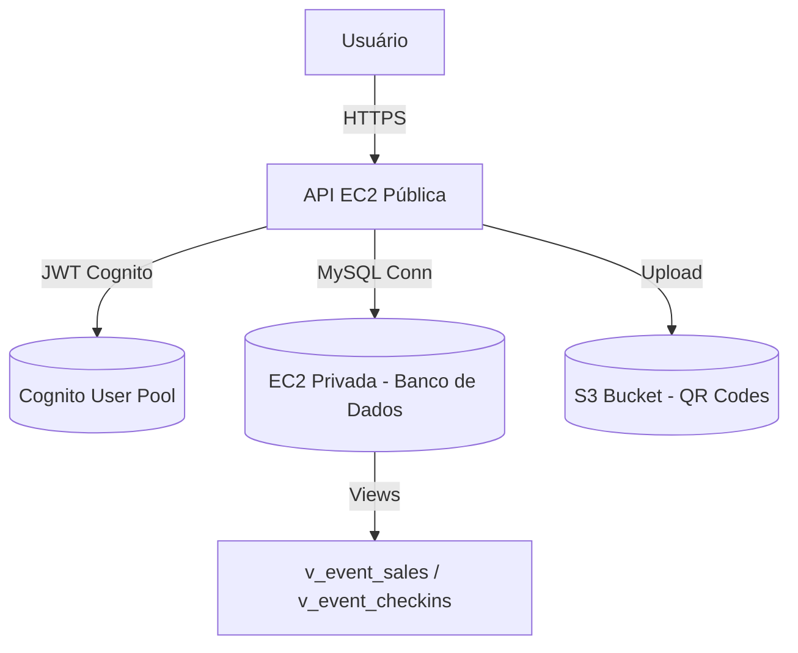

# 📦 **APAE Eventos Backend**


API REST desenvolvida em **Node.js + Express**, para **gestão de eventos e ingressos com QR Code**, implantada em **infraestrutura AWS**.  
Integra **MySQL (EC2 privada)**, **Cognito** para autenticação e **S3** para armazenamento de QR Codes.

---

## ☁️ **Arquitetura AWS**

**Componentes:**
- EC2 Pública → API Node.js (porta 3000)
- EC2 Privada → Banco MySQL (porta 3306)
- S3 Bucket → Armazena imagens de QR Codes
- Cognito → Autenticação e roles (`admin`, `staff`, `default`)
- IAM Role → Permissões automáticas de acesso ao S3

---

## 🚀 **Como rodar o projeto localmente**
```bash
# 1️⃣ Clone o repositório
git clone https://github.com/RTeixe0/apae-backend.git
cd apae-backend

# 2️⃣ Instale dependências
npm install

# 3️⃣ Configure o ambiente
cp .env.example .env

# 4️⃣ Crie o banco de dados
mysql -u root -p -e "CREATE DATABASE apae;"

# 5️⃣ Rode as migrações
mysql -u root -p apae < migrations/CreateTables.sql

# 6️⃣ Inicie o servidor
npm start
```
> Porta padrão: `3000`

---

## 🧠 **Principais Módulos**
| Módulo | Descrição |
|:--|:--|
| 🎉 **Eventos** | CRUD completo de eventos com data, local, preço, banner e status |
| 🎟️ **Ingressos** | Geração em lote, com QR Codes armazenados no S3 |
| 🧾 **Validação QR Code** | Check-in e verificação de uso via app mobile |
| 👥 **Autenticação (Cognito)** | Login, roles e tokens JWT |
| 💳 **Pagamentos (em breve)** | Estrutura pronta para PIX / Stripe |
| 📊 **Relatórios** | Views SQL otimizadas: `v_event_sales`, `v_event_checkins` |
| 🔐 **Segurança** | Controle granular de roles `admin` / `staff` / `default` |

---

## ⚙️ **Variáveis de Ambiente**
```env
PORT=3000
DB_HOST=localhost
DB_USER=root
DB_PASS=sua_senha
DB_NAME=apae

COGNITO_REGION=sa-east-1
COGNITO_USER_POOL_ID=sa-east-1_XXXXXX
COGNITO_CLIENT_ID=xxxxxxxxxxxxxxxxxx

S3_BUCKET=apae-qrcodes
S3_REGION=sa-east-1
```

---

## 🔐 **Segurança Implementada**
- VPC isolada (sub-rede privada para banco de dados)
- IAM Role: acesso seguro ao S3 sem chaves locais
- JWT Cognito: autenticação e autorização
- ACL privada no S3 (sem objetos públicos)
- Sanitização e validação de entrada no backend
- Logs e auditoria em `validations` e `logs`

---

## 🧪 **Testando a API**
```bash
# Obter token Cognito
aws cognito-idp initiate-auth \
  --auth-flow USER_PASSWORD_AUTH \
  --client-id <COGNITO_CLIENT_ID> \
  --auth-parameters USERNAME="usuario@teste.com",PASSWORD="Senha#123"

# Listar eventos autenticado
curl -H "Authorization: Bearer <TOKEN>" http://localhost:3000/events
```

---

## 🧩 **Tecnologias Utilizadas**
| Categoria | Tecnologia |
|------------|-------------|
| Backend | Node.js + Express |
| Banco | MySQL 8.0 |
| Autenticação | AWS Cognito |
| Armazenamento | AWS S3 |
| Infraestrutura | EC2, IAM, VPC, NAT |
| QR Code | `qrcode`, `canvas` |
| Monitoramento | PM2 + Logs em `/var/log/pm2` |

---

## 🧾 **Relatórios SQL**
- `v_event_sales` → Estatísticas de vendas e receita  
- `v_event_checkins` → Monitoramento de check-ins e presença

---

## 👨‍💻 **Colaboração**
```bash
git checkout -b feature/nova-funcionalidade
npm run lint
git commit -m "feat: adiciona nova feature"
git push origin feature/nova-funcionalidade
```
Abra um **Pull Request** para `main`.

---

## 🧩 **Próximos Passos**
- [ ] Integração com PIX / PagSeguro
- [ ] Upload de banner via app mobile
- [ ] Dashboard de relatórios administrativos

---

## 🎓 **Projeto Integrador — FATEC Itapira (DSM)**
```bash
# ---------------------------------------------------------
# Curso: Desenvolvimento de Software Multiplataforma (DSM)
# Instituição: FATEC Itapira — Centro Paula Souza
#
# Sistema: APAE EVENTOS — Solução completa de gestão de eventos e ingressos
# Infraestrutura: AWS (EC2 + S3 + Cognito + MySQL)
# Tecnologias: Node.js · Express · React Native · Expo
#
# 🔗 Frontend do Projeto:
# 👉 https://github.com/rafaelhgreco/ApaeEventos_frontend
#
# 👨‍💻 Equipe de Desenvolvimento
# ---------------------------------------------------------
# 🧠 Renan Teixeira
#    GitHub: https://github.com/RTeixe0
#
# 🎨 Rafael Henrique Greco
#    GitHub: https://github.com/rafaelhgreco
#
# 🧩 Rodrigo de Almeida
#    GitHub: https://github.com/RodsAlmeidaR
#
# 🗄️ João Pedro Doni
#    GitHub: https://github.com/DoniJoao
#
# 🎯 Objetivo:
# Criar uma plataforma integrada para a APAE com controle de eventos,
# geração de ingressos com QR Code e check-in digital.
# ---------------------------------------------------------
```
